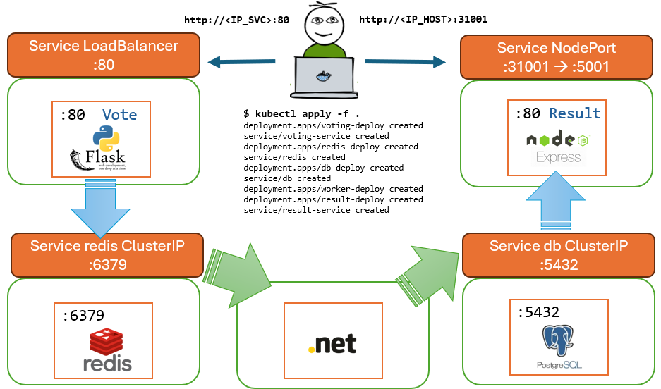

# Kubernetes Cats and Dogs Voting App

Source: https://github.com/dockersamples/example-voting-app


## Arquitectura




* Aplicación web para votar, un front-end con Python y Flask, espera solicitudes por el puero 80, para mostrar la interface y al hacer clic en la opción deseada almacena el resultado mediante el servicio redis. Mantiene un solo voto por cliente. [Voting APP](https://github.com/dockersamples/example-voting-app/tree/main/vote)

* Almacenamiento de votos en Redis: [Redis](https://hub.docker.com/_/redis/) 

* Proceso, implmentado en C#.NET, para, cada 100ms, leer los votos almacenados en Redis y almacenarlos en la Base de Datos PostgreSQL [Worker .NET](https://github.com/dockersamples/example-voting-app/tree/main/worker) 

* Base de datos PostgreSQL para almacenar los votos: [Postgres](https://hub.docker.com/_/postgres/)

* Aplicación Web para mostrar los resultados en tiempo real, un frontend con Nodejs, Express y angular, que atiende solicitudes por el puerto 80, conecta con el servicio db y muestra los resulatdos. [Results App](https://github.com/dockersamples/example-voting-app/tree/main/result) 


## Despliegue

* Deployment y Servicio LoadBalancer para la Aplicación Voting App.

```yaml

apiVersion: apps/v1
kind: Deployment
metadata:
  name: voting-deploy
  labels:
    app: voting-app

spec:
  template:
    metadata:
      labels:
        app: voting-app
    spec:
      containers:
      - name: voting-app
        image: dockersamples/examplevotingapp_vote:before
        ports:
        - name: voting-port
          containerPort: 80
          
  replicas: 1
  selector:
    matchLabels:
      app: voting-app

---

apiVersion: v1
kind: Service
metadata:
  name: voting-service
  labels:
    app: voting-app
spec:
  type: LoadBalancer
  ports:
  - name: vote-service-port
    port: 80
    targetPort: 80
  selector:
    app: voting-app

```

* Deployment para Redis y Servicio ClusterIP denominado redis

```yaml

apiVersion: apps/v1
kind: Deployment
metadata:
  name: redis-deploy
  labels:
    app: redis

spec:
  template:
    metadata:
      labels:
        app: redis
    spec:
      containers:
      - image: redis:alpine
        name: redis
        ports:
        - containerPort: 6379
          name: redis
        volumeMounts:
        - mountPath: /data
          name: redis-data
      volumes:
      - name: redis-data
        emptyDir: {} 

  replicas: 1
  selector:
    matchLabels:
      app: redis

---

apiVersion: v1
kind: Service
metadata:
  name: redis
  labels:
    app: redis

spec:
  type: ClusterIP
  ports:
  - name: redis-service-port
    port: 6379
    targetPort: 6379
  selector:
    app: redis

```

* Deployment para la base de datos PostgreSQL y Servicio ClusterIP denominado db

```yaml

apiVersion: apps/v1
kind: Deployment
metadata:
  name: db-deploy
  labels:
    app: db

spec:
  template:
    metadata:
      labels:
        app: db
    spec:
      containers:
      - image: postgres:9.4
        name: postgres
        env:
        - name: POSTGRES_HOST_AUTH_METHOD
          value: "trust"
        - name: POSTGRES_USER
          value: postgres
        - name: POSTGRES_PASSWORD
          value: postgres
        ports:
        - containerPort: 5432
          name: postgres
        volumeMounts:
        - mountPath: /var/lib/postgresql/data
          name: db-data
      volumes:
      - name: db-data
        emptyDir: {} 

  replicas: 1
  selector:
    matchLabels:
      app: db

---

apiVersion: v1
kind: Service
metadata:
  name: db
  labels:
    app: db
spec:
  type: ClusterIP
  ports:
  - name: "db-service"
    port: 5432
    targetPort: 5432
  selector:
    app: db

```

* Deployment para el proceso de extracción de votos de redis y almacenamiento en db.

```yaml

apiVersion: apps/v1
kind: Deployment
metadata:
  name: worker-deploy
  labels:
    app: worker
spec:
  replicas: 1
  selector:
    matchLabels:
      app: worker
  template:
    metadata:
      labels:
        app: worker
    spec:
      containers:
      - image: dockersamples/examplevotingapp_worker
        name: worker

```

* Deployment y Servicio NodePort para la Aplicación que muestra las resultados

```yaml

apiVersion: apps/v1
kind: Deployment
metadata:
  name: result-deploy
  labels:
    app: result

spec:
  replicas: 1
  selector:
    matchLabels:
      app: result
  template:
    metadata:
      labels:
        app: result
    spec:
      containers:
      - image: dockersamples/examplevotingapp_result:before
        name: result
        ports:
        - containerPort: 80
          name: result

---

apiVersion: v1
kind: Service
metadata:
  name: result-service
  labels:
    app: result
spec:
  type: NodePort
  ports:
  - name: result-service-port
    port: 5001
    targetPort: 80
    nodePort: 31001
  selector:
    app: result

```

Aplicar los manifiestos:

```
$ kubectl apply -f .

deployment.apps/voting-deploy created
service/voting-service created
deployment.apps/redis-deploy created
service/redis created
deployment.apps/db-deploy created
service/db created
deployment.apps/worker-deploy created
deployment.apps/result-deploy created
service/result-service created
```

